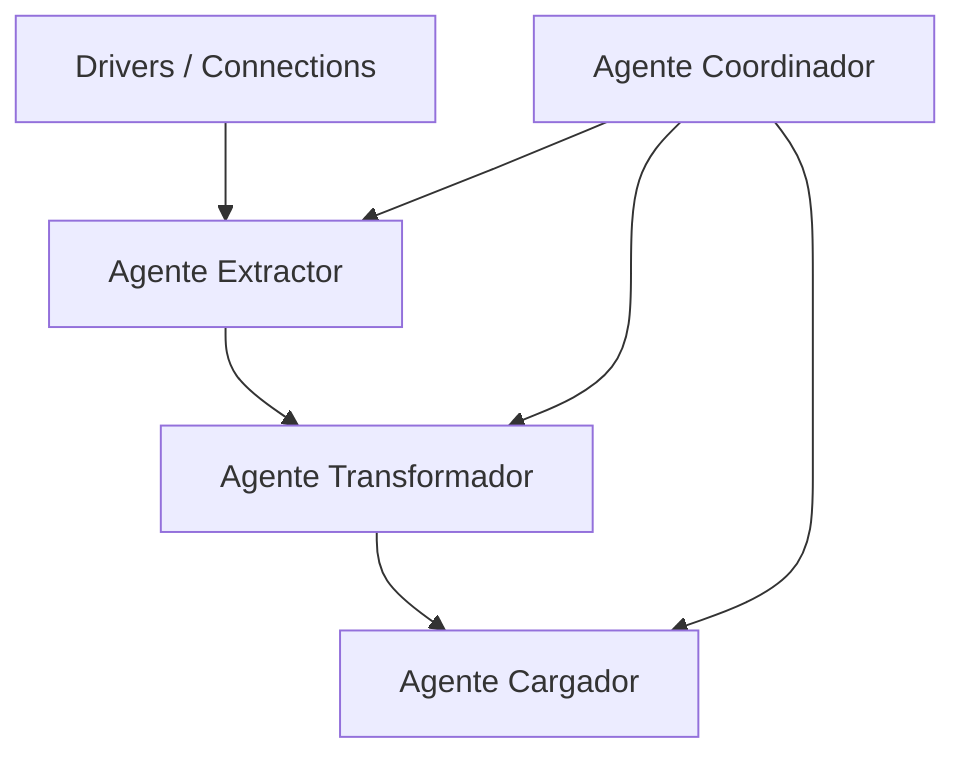

# Implementation Plan: Pipeline Multiagente ETL para Data Mart (TAIS_DM)

**Branch**: `001-multiagent-etl` | **Date**: 2026-05-18 | **Spec**: [spec.md](./spec.md)

**Input**: Feature specification from `specs/001-multiagent-etl/spec.md`

---

## Summary

Este plan detalla la construcción secuencial y robusta del pipeline ETL de agentes cooperativos en Python, diseñado para extraer de forma incremental datos de asistencia social de la base transaccional (`Secretaria` OLTP), transformarlos bajo el modelo multidimensional de la Metodología Hefesto, e insertarlos de forma atómica en el Data Mart (`TAIS_DM` OLAP). La arquitectura se rige bajo principios de Spec-Driven Development (SDD) y Test-Driven Development (TDD) para garantizar un 90%+ de cobertura.

---

## Technical Context

- **Language/Version**: Python 3.10.11 o superior.
- **Primary Dependencies**: SQLAlchemy 2.0.x, Pandas 2.2.x, Pytest 8.x, Pytest-Cov (cobertura), Pydantic v2.x (validación de esquemas/contratos).
- **Storage**:
  - Origen OLTP: PostgreSQL / SQL Server ("Secretaria").
  - Destino OLAP: PostgreSQL / SQL Server ("TAIS_DM").
  - Test/Desarrollo Local: SQLite en memoria para mock de bases OLTP y OLAP.
- **Testing**: Pytest con fixtures tipadas y mocking mediante `unittest.mock`.
- **Target Platform**: Servidor Linux / Docker Container.
- **Project Type**: ETL Pipeline / Multi-Agent System.
- **Performance Goals**: Procesamiento de 50,000 registros en menos de 20 segundos de extremo a extremo (latencia inferior a 1 ms por inserción).
- **Constraints**: Aislamiento transaccional estricto (atomicidad a nivel de lote), geografía restringida estrictamente a Salta, normalización del índice de vulnerabilidad en el rango `[0.00, 1.00]`.
- **Scale/Scope**: 12 Dimensiones y 1 Tabla de Hechos principal, atendiendo a miles de beneficiarios y transacciones mensuales de Tarjetas sociales.

---

## Constitution Check

*GATE: Must pass before Phase 0 research. Re-check after Phase 1 design.*

- **SDD Compliance**: ✅ Cada agente se describe formalmente en `spec.md` definiendo interfaces y aserciones.
- **TDD Compliance**: ✅ Se requiere escribir los test en estado "Fallo" antes de codificar la lógica de producción. Cobertura obligatoria >= 90%.
- **Metodología Hefesto**: ✅ El mapeo y flujo de carga de dimensiones y la tabla de hechos respetan las métricas oficiales.
- **Aislamiento de Entornos**: ✅ El pipeline separa totalmente las conexiones transaccionales de las analíticas en `connections.py`.

---

## Project Structure

### Documentation (this feature)

```text
specs/001-multiagent-etl/
├── spec.md              # Feature specification (completed & clarified)
├── plan.md              # This file (implementation plan)
├── research.md          # Phase 0 output: Research and design justifications
├── data-model.md        # Phase 1 output: Multi-agent schema and mappings
├── quickstart.md        # Phase 1 output: Setup and developer guide
├── contracts/           # Phase 1 output: JSON schemas for agent interfaces
└── tasks.md             # Phase 2 output: Actionable tasks list (tasks workflow)
```

### Source Code (repository root)

```text
src/
├── agents/
│   ├── __init__.py
│   ├── coordinador/
│   │   ├── __init__.py
│   │   └── orchestrator.py    # Clase CoordinadorAgent
│   ├── extractor/
│   │   ├── __init__.py
│   │   └── fetcher.py         # Clase ExtractorAgent
│   ├── transformador/
│   │   ├── __init__.py
│   │   └── refiner.py         # Clase TransformadorAgent
│   └── cargador/
│       ├── __init__.py
│       └── writer.py          # Clase CargadorAgent
├── drivers/
│   ├── __init__.py
│   └── connections.py         # Pool SQLAlchemy para OLTP y OLAP
tests/
├── __init__.py
├── contract/
│   ├── __init__.py
│   └── test_contracts.py      # Pruebas de esquemas de datos intermedios
├── integration/
│   ├── __init__.py
│   └── test_pipeline.py       # Pruebas de integración del flujo de agentes
└── unit/
    ├── __init__.py
    ├── test_coordinador.py
    ├── test_extractor.py
    ├── test_transformador.py
    └── test_cargador.py
```

**Structure Decision**: Se adopta la estructura unificada monolítica con separación limpia de agentes (`src/agents/`) y lógica de conexiones comunes (`src/drivers/connections.py`). Esto facilita el intercambio de DataFrames en memoria y la importación de módulos en la suite de pruebas unitarias.

---

## 1. Arquitectura de Dependencias y Secuencia de Construcción

### Secuencia de Construcción Física (Bottom-Up)
Para asegurar el testeo aislado y robusto, el desarrollo sigue un orden de dependencias estrictas:



1. **DBConnectionManager (`src/drivers/connections.py`)**: Inicialización del gestor de conexiones para soportar transacciones.
2. **Agente Extractor (`src/agents/extractor/`)**: Primero en el flujo de datos. Si no hay extracción válida de la base `Secretaria`, no hay datos para transformar ni cargar.
3. **Agente Transformador (`src/agents/transformador/`)**: Consume los DataFrames del Extractor. Su lógica corre 100% en memoria mediante Pandas, lo que permite testearlo de forma aislada sin dependencias de base de datos activas (mediante mock de DataFrames).
4. **Agente Cargador (`src/agents/cargador/`)**: Depende de que las transformaciones hayan finalizado con éxito. Recibe DataFrames limpios y los persiste en `TAIS_DM`.
5. **Agente Coordinador (`src/agents/coordinador/`)**: Orquestador de alto nivel. Se construye al final para coordinar los ciclos de vida de agentes individuales ya validados y robustecidos.

### Interacción en Memoria (DataFrame Payloads)
Los datos no se escriben en archivos intermedios. El Extractor devuelve un diccionario de Pandas DataFrames indexados por nombre de tabla fuente. El Transformador toma este diccionario, procesa y genera un nuevo diccionario de DataFrames correspondientes a las dimensiones homologadas y la tabla de hechos. El Cargador consume este último diccionario para realizar la persistencia transaccional.

---

## 2. Estrategia de Test-Driven Development (TDD) y Aislamiento

### Estructura de Fixtures de Pytest para OLTP 'Secretaria'
En `tests/conftest.py`, crearemos fixtures que construyen una base de datos SQLite en memoria que replica las tablas esenciales de la base SQL Server `Secretaria`:

```python
import pytest
from sqlalchemy import create_engine, Table, Column, Integer, String, Numeric, DateTime, Boolean, MetaData

@pytest.fixture(scope="function")
def mock_oltp_engine():
    engine = create_engine("sqlite:///:memory:")
    metadata = MetaData()
    
    # Tabla Persona
    Table('Persona', metadata,
          Column('id', Integer, primary_key=True),
          Column('nombre', String(100)),
          Column('ingresos_estimados', Numeric(10, 2)),
          Column('fecha_modificacion', DateTime),
          Column('municipio_id', Integer))
          
    # Tabla Familia
    Table('Familia', metadata,
          Column('id', Integer, primary_key=True),
          Column('indice_vulnera', Numeric(5, 2)),
          Column('fecha_modificacion', DateTime))
          
    # Tabla Municipio
    Table('Municipio', metadata,
          Column('id', Integer, primary_key=True),
          Column('nombre', String(100)))

    # Tabla Tarjeta
    Table('Tarjeta', metadata,
          Column('id', Integer, primary_key=True),
          Column('persona_id', Integer),
          Column('activa', Boolean),
          Column('monto_asignado', Numeric(10, 2)),
          Column('fecha_modificacion', DateTime))

    metadata.create_all(engine)
    return engine
```

### Estrategia de Mocking para Stored Procedures OLTP
Para simular el cómputo analítico delegado al servidor transaccional OLTP (`sp_CalcularCrecimientoMunicipal`, `sp_PorcentajeMejoraPersona`, etc.) de forma aislada, utilizaremos `unittest.mock`:

```python
from unittest.mock import MagicMock

def test_transformador_computo_sp():
    # Mock de la conexión y ejecución de SPs
    mock_session = MagicMock()
    
    # Configurar el retorno del Stored Procedure sp_NivelSatisfaccionPromedio
    mock_session.execute.return_value.scalar.side_effect = [
        0.85,  # sp_NivelSatisfaccionPromedio para Programa 1
        0.72   # sp_PorcentajeMejoraPersona para Persona 1
    ]
    
    # El Transformador invocará mock_session.execute(...) y recibirá el valor analítico
```

### Verificación de la Atomicidad y Aislamiento de Transacciones
Para asegurar que no existan escrituras parciales, las pruebas de integración simularán fallos durante la carga de hechos:
1. Iniciar transacción en la base OLAP `TAIS_DM`.
2. Insertar dimensiones exitosamente.
3. Simular una excepción de base de datos al insertar en `factPolíticasAlimentarias` (ej. violación de foreign key).
4. Validar que la base de datos experimental no persistió ninguna de las dimensiones cargadas al inicio (verificar el Rollback automático controlado por el bloque `try/except` del Cargador y Coordinador).

---

## 3. Plan de Carga Incremental y Mapeo Crítico (Hefesto)

El plan de construcción se segmenta en **4 Hitos atómicos** para garantizar la trazabilidad de la Metodología Hefesto:

### Hito 1: Orquestación e Infraestructura de Conexión (Coordinador + Drivers)
- **Objetivo**: Implementar `DBConnectionManager` y la estructura base del `CoordinadorAgent` con trazabilidad de ejecuciones.
- **Entregables**:
  - `src/drivers/connections.py` con pools de conexiones y soporte para SQLite en memoria de pruebas y bases reales PostgreSQL/SQL Server.
  - `src/agents/coordinador/orchestrator.py` implementando el bucle del pipeline, control de reintentos (backoff exponencial) y logs de auditoría en la tabla `registro_ejecuciones`.
- **Verificación**: Ejecutar suite de test unitarios de Coordinador con mock de agentes y verificar reintentos exitosos.

### Hito 2: Hidratación de Dimensiones y Agente Extractor (Extractor + Mapeo Base)
- **Objetivo**: Codificar el `ExtractorAgent` para consultas paginadas e incrementalidad.
- **Entregables**:
  - `src/agents/extractor/fetcher.py` con métodos para extraer lotes incrementales de 5,000 registros con pausas de 500 ms (throttling).
  - Conversión rigurosa de tipos SQL `money` a `decimal.Decimal` en memoria.
  - Carga limpia de las dimensiones independientes (`dimTiempo`, `dimGeografia`, `dimBeneficiarios`, `dimProgramas`).
- **Verificación**: Validar con base transaccional temporal que la extracción incremental no cargue duplicados.

### Hito 3: Transformación Multidimensional e Integración OLTP (Transformador)
- **Objetivo**: Codificar la lógica analítica de `TransformadorAgent`.
- **Entregables**:
  - `src/agents/transformador/refiner.py` con mapeo de municipios de Salta y derivación de registros huérfanos a `curacion_geografica`.
  - Integración de llamadas mockeadas a Stored Procedures transaccionales (`sp_CalcularCrecimientoMunicipal`, `sp_PorcentajeMejoraPersona`, etc.).
  - Normalización en memoria de la métrica `vulneraSocial` en escala flotante de `0.00` a `1.00`.
- **Verificación**: Verificar la transformación de 10,000 registros sintéticos en memoria en < 2 segundos.

### Hito 4: Carga Atómica y Integridad Referencial (Cargador + Hechos)
- **Objetivo**: Implementar `CargadorAgent` con transaccionalidad total.
- **Entregables**:
  - `src/agents/cargador/writer.py` que ejecuta cargas transaccionales atómicas en `TAIS_DM`.
  - Resolución e inyección de Surrogate Keys (Claves subrogadas) en la tabla `factPolíticasAlimentarias` para métricas `admPersonas`, `vulneraSocial`, `efiProgramas`, `participaMunicipal` y `usoTarjetas`.
- **Verificación**: Forzar fallo de FK en tabla de hechos en suite de pruebas de integración y verificar rollback total.

---

## 4. Matriz de Riesgos Técnicos y Mitigación

| Riesgo Técnico | Impacto | Estrategia de Mitigación y Protocolo Codificado |
|:---|:---|:---|
| **Desbordamiento o pérdida de precisión en tipos `money`/`decimal`** | Alto | **Mitigación**: Se prohíbe el casteo a flotantes (`float`) en Python. El Extractor debe utilizar la clase nativa `decimal.Decimal` de Python. Las aserciones `ASSERT-EXT-01` de la suite Pytest verificarán el tipo exacto de cada columna numérica financiera. |
| **Pérdida de conectividad a mitad de lote (Fallo de Red)** | Crítico | **Mitigación**: Aislamiento transaccional estricto `READ COMMITTED`. La carga de hechos y dimensiones asociadas se realiza bajo un bloque `with session.begin():` de SQLAlchemy. Ante cualquier excepción, se invoca automáticamente `session.rollback()`. El Coordinador marca el estado en `registro_ejecuciones` como `FAILED` y levanta una alerta estructurada. |
| **Colisiones de Llaves de Negocio (Duplicados)** | Medio | **Mitigación**: La lógica de inserción en el Cargador implementa sentencias "Upsert" (e.g., `ON CONFLICT DO UPDATE` en PostgreSQL o cláusulas `MERGE` en SQL Server). Esto asegura la idempotencia del pipeline si se ejecuta dos veces para el mismo período. |
| **Registros con Geografía Inválida (Fuera de Salta)** | Medio | **Mitigación**: Política de Aislamiento y Continuidad. El Transformador filtra las filas geográficamente incorrectas del flujo principal y las escribe en `curacion_geografica` con un Warning en la bitácora de auditoría, permitiendo que el resto del lote se cargue sin problemas. |
