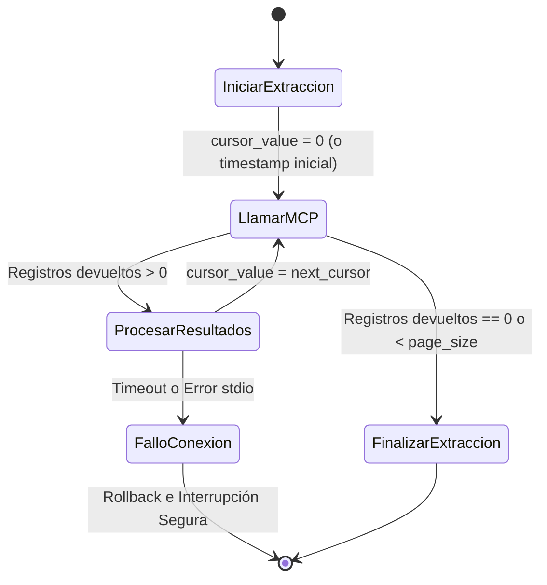

# Data Model & State: Acceso a Bases de Datos mediante MCP (mcp-db-access)

Este documento detalla las estructuras de datos, payloads de mensajes y estados de cursor que se manejan en el cliente MCP de base de datos.

## 1. Esquema de Mensajes y Payloads MCP

### Payload de Extracción (Llamada a `get_incremental_data`)
La llamada a la herramienta del MCP `secretaria-local` envía el siguiente esquema:

```json
{
  "table_name": "Persona",
  "start_date": "2026-05-01T00:00:00",
  "end_date": "2026-05-19T00:00:00",
  "cursor_value": 0,
  "page_size": 5000
}
```

### Respuesta de Extracción (Herramienta `get_incremental_data`)
El contenido de texto retornado por la herramienta se serializa como un objeto JSON estructurado:

```json
{
  "records": [
    {
      "id": 1,
      "nombre": "Juan Pérez",
      "ingresos_estimados": "150000.50",
      "fecha_modificacion": "2026-05-18T14:30:00",
      "municipio_id": 5
    }
  ],
  "next_cursor": 1
}
```

*Nota: Los valores numéricos de alta precisión (`Decimal`) se transmiten como cadenas de texto en el JSON para evitar pérdidas de precisión en punto flotante durante la serialización, y son casteados a `decimal.Decimal` en el agente.*

### Payload de Carga (Llamada a `load_dimension` / `load_fact`)
El Cargador envía lotes de registros conformados al MCP `tais-dm-local`:

```json
{
  "dim_name": "dimBeneficiarios",
  "records": [
    {
      "beneficiario_id": 1,
      "nombre": "Juan Pérez",
      "ingresos_estimados": "150000.50",
      "grupo_vulnera_id": 2
    }
  ]
}
```

---

## 2. Seguimiento del Cursor / Watermark

El ciclo de vida del cursor durante la extracción incremental mantiene el siguiente flujo de estados:



### Estructura del Estado del Cursor en Memoria
El `ExtractorAgent` mantiene en memoria el siguiente diccionario para registrar el progreso:

```python
cursor_state = {
    "Persona": {"column": "id", "last_value": 0},
    "Familia": {"column": "id", "last_value": 0},
    "Tarjeta": {"column": "id", "last_value": 0}
}
```
*Si se extrae por fecha, `last_value` contendrá la representación ISO string del último `fecha_modificacion`.*
